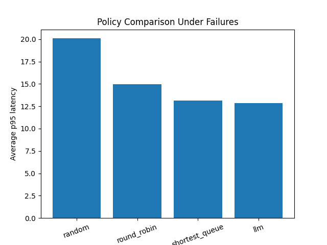

# Distributed System Simulator (SimPy) — Policy Evaluation Under Failures

A discrete-event simulator for distributed request routing (load balancing) built with **SimPy**.  
It evaluates routing policies under **server failures** and reports performance using **p50/p95 latency** and throughput.

## Why this project
Real distributed systems face queueing, contention, failures, and bursty traffic.  
This project provides a reproducible framework to compare control policies in those conditions.

## Key Features
- Discrete-event simulation using **SimPy**
- System model: Clients → Load Balancer → N Servers (with queues)
- Failure injection: servers crash/recover periodically
- Policies implemented:
  - Random
  - Round Robin
  - Shortest Queue
- Metrics:
  - Average latency
  - p50 / p95 latency
  - Completed jobs (throughput proxy)
- Experiments across multiple random seeds

## Results (example)
> Under failures, **Shortest Queue** achieved the lowest p95 latency vs Round Robin and Random.



## Getting Started
### Requirements
- Python 3.7+
- simpy
- matplotlib

### Install
```bash
pip install -r requirements.txt

### Run
```bash
pip install simpy matplotlib
python simulator.py

That’s it.

---

## Tiny safety tip (recommended)
Before making changes, create a branch:

```powershell
git checkout -b week2-polish
